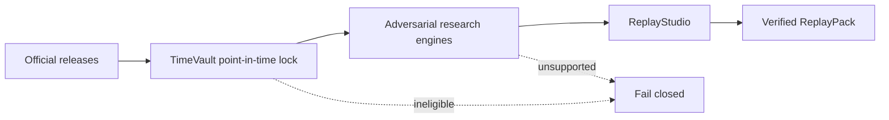

# FinReplay OS

**Put the market back in time. Put the strategy on trial. Decide whether to allocate capital.**

FinReplay OS is a planned point-in-time financial-system digital twin and adversarial
quant research platform. It is being built to answer a stricter question than “did this
strategy backtest well?”:

> Using only information that was actually knowable at the decision time, does the claim
> survive leakage, multiple testing, regime change, execution costs, capacity limits,
> incomplete institutional exposures, and decision reversal analysis?

## Current status

**Pre-alpha implementation in progress.** This repository must not yet be described as a
finished platform, a production risk system, a billion-row deployment, or evidence of
investment performance, institutional adoption, external validation, or real-world impact.

| Target | Current evidence | Completion rule |
|---|---|---|
| Seven connected engines | Seven run in one deterministic SVB boundary flow over seven locked SEC facts; the committed pack and clean-worktree two-rebuild receipt pass 12 cross-engine assertions | All seven execute in an end-to-end ReplayPack with tests |
| 20–30 official-data adapters | 30 live-validated: 8 FDIC, 3 SEC, 5 Treasury, 9 New York Fed, 1 BLS, and 4 distinct CFTC COT products; temporal eligibility is recorded per source | Each counted adapter retrieves and validates an official source or fails honestly |
| 30 historical/boundary scenarios | 27/30 internally replay-proven: three bank boundaries plus 24 source-diverse macro, policy, rate, energy, labor, producer-price, Treasury, production, retail-sales, housing, home-sales, consumer-credit, construction-spending, house-price-index, durable-goods, international-trade, natural-gas, and CFTC open-interest boundaries pass the eight-gate verifier | Each scenario passes evidence gates and produces a versioned ReplayPack |
| Billion-record scale | Not achieved | Machine manifest proves at least 1,000,000,000 distinct public records processed and queried |
| Public demo and external review | Not achieved | Public read-only deployment plus recorded independent reproduction/review |

The machine-auditable requirements are maintained in
[`docs/verification/acceptance-matrix.md`](docs/verification/acceptance-matrix.md).

[Seven engines](#the-seven-engines) · [Compact workflow](#compact-workflow) · [Run locally](#local-development) · [Scenario evidence](#scenario-evidence) · [Truth boundaries](#truth-boundaries)

## The seven engines

1. **TimeVault** — bitemporal storage and “what was knowable then?” queries.
2. **TrialCourt** — preregistration, complete experiment history, leakage and multiplicity attacks.
3. **MarketTwin** — evidence-graded bank–fund–security–issuer networks.
4. **ShockCompiler** — observed, bounded, counterfactual, and adversarial shock programs.
5. **ExecutionLab** — cost, latency, queue, liquidity, capacity, and failure envelopes.
6. **CapitalAllocator** — robust allocation, constraints, reversal thresholds, and value of information.
7. **ReplayStudio** — human-readable and machine-readable ReplayPack reports.

## Compact workflow



The main workflow stays deliberately small. Source-specific eligibility rules, the seven-engine
contract, and all 27 replay summaries remain available below as detailed evidence rather than
expanding this diagram.

## Truth boundaries

- `observed`, `reported`, `extracted`, `inferred`, and `simulated` are never merged.
- Economic time and knowledge/availability time are separate fields.
- A current revised value cannot silently replace a historical vintage.
- Public-data cases are not clients; historical replays are not live trading.
- Simulated P&L is not investment performance.
- Tests and hashes prove internal behavior, not source authenticity or real-world impact.
- Missing market microstructure or exposure data produces bounds, not fabricated precision.

## Intended first vertical slice

The first release gate is an SVB 2023 point-in-time reconstruction using official SEC, FDIC,
ALFRED/FRED, and U.S. Treasury data. No second flagship slice counts as complete until a fresh
environment can reproduce the first one without leaking revised future values.

## Local development

The supported runtime is Python 3.11 or newer. The current pre-alpha verification loop is:

```bash
python -m venv .venv
.venv/bin/pip install -e '.[dev]'
.venv/bin/ruff check .
.venv/bin/mypy src tests
.venv/bin/pytest --cov=finreplay --cov-report=term-missing
```

Live SEC validation additionally requires an accountable `FINREPLAY_SEC_USER_AGENT` containing
a real contact email, as required by SEC fair-access guidance. The value is sent only as an HTTP
header and is not persisted in receipts. Local raw responses and DuckDB files are gitignored;
portable content hashes and bounded evidence receipts are committed under `verification/live/`.
The latest one-per-adapter evidence inventory can be rebuilt with
`python scripts/verify_live_receipts.py`; legacy schema-1.0 receipts remain historical Git evidence
but are excluded from current adapter counts.

<details>
<summary><strong>Open source-by-source validation and timing notes</strong></summary>

These notes preserve the exact validation command, knowledge-time rule, and claim boundary for
each supporting source.

The nine New York Fed products can be revalidated with
`python scripts/validate_nyfed_catalog.py`. They are deliberately `latest_only`: event, as-of,
release, and `lastUpdated` fields remain in the payload but do not backdate the exact retrieved
value. Source-content reuse remains subject to the current New York Fed Terms of Use, including
the additional reference-rate attribution and non-endorsement conditions.

The fixed BLS CPI-U product and four independently classified CFTC COT products can be
revalidated with `python scripts/validate_bls.py` and
`python scripts/validate_cftc_catalog.py`. BLS annual-average `M13` rows remain in the hashed raw
response but are excluded from the monthly normalized stream. CFTC historical rows are immutable
published observations, yet the generic API receipts remain ineligible for historical
decision-time use until a row-specific release timestamp is independently bound.

The counted CFTC TFF boundary uses `cftc.cot.tff_scheduled_ust2y` as a scenario-specific
supporting source. It retrieves exactly three July 2026 UST 2Y NOTE Futures Only rows, cross-checks
every selected field against the annual ZIP, and binds the current release schedule, policy page,
and complete TFF notes PDF. The schedule calls itself tentative and CFTC provides no row-level
actual-publication log, so the records retain `0.98` confidence and say official scheduled
availability rather than exact actual publication. Category positions, trader counts, and the
face-value label set no range endpoint or notional claim. This source remains outside the capped
formal 30-adapter inventory.

The GDP revision scenario uses `fred.alfred.vintage_gdp` as a separately verified supporting
source. It retrieves four explicitly named ALFRED snapshots, retains raw CSV only in local ignored
storage, and applies a two-calendar-day conservative knowledge bound because a vintage date does
not establish an intraday release timestamp. It is deliberately absent from the formal adapter
inventory, so the capped target remains exactly 30 rather than silently becoming 31.

The BTFP growth scenario likewise uses
`federal_reserve.h41.btfp_historical_release` as a separately verified supporting source. It
retrieves only three explicitly dated archived H.4.1 pages, parses the BTFP Table 1 row, retains
full HTML locally, and applies the same conservative date-plus-two-day rule. It also remains outside
the formal 30-adapter inventory.

The payroll-release scenario uses `bls.employment_situation.archived_release` as a third verified
supporting source. It retrieves only the January 6, February 3, and March 10, 2023 BLS archive
pages, strictly parses the report-period headline and stated 8:30 a.m. Eastern embargo end, and
keeps each headline value as a versioned release-snapshot fact rather than replacing it with later
revisions. The January release's annual benchmark and seasonal-factor changes remain an explicit
comparability limitation. This source is also outside the formal 30-adapter inventory.

The target-range scenario uses `federal_reserve.fomc.archived_statement` as another verified
supporting source. It retrieves only the February 1, March 22, and May 3, 2023 statement pages,
strictly parses their target endpoints, and validates each page's 2:00 p.m. EST/EDT release label
against `America/New_York` before UTC conversion. Full HTML remains local; this source is also
outside the formal 30-adapter inventory.

The CPI-release scenario uses `bls.cpi.archived_release` as another verified supporting source.
It retrieves only the January 12, February 14, and March 14, 2023 archive pages, strictly parses
their CPI-U all-items headlines, and validates the 8:30 a.m. Eastern embargo end with
`America/New_York`. Each value remains tied to its archived release snapshot. The February page's
annual weight update and five-year seasonal recalculation are an explicit comparability limit, so
the resulting interval is a release-snapshot stress range rather than a calibrated forecast. Full
HTML remains local and this source is outside the formal 30-adapter inventory.

The Treasury-curve scenario uses `fred.alfred.vintage_treasury_yield` as another supporting
source. It retrieves only six DGS2/DGS10 observations across three explicitly named ALFRED
vintages, converts reported percent yields exactly to integer basis points, and applies the same
conservative date-plus-two-day knowledge bound used by the GDP connector. The derived
10-year-minus-2-year spread is not represented as upstream reported data. Raw CSV stays in ignored
download-only storage and this source is outside the formal 30-adapter inventory.

The TGA cash-boundary scenario uses `treasury.dts.published_report` as another supporting source.
It retrieves only the May 31, June 1, and June 2, 2023 date-stamped Daily Treasury Statement PDFs,
strictly parses and arithmetically reconciles Table I, and uses Treasury's following-business-day
4:00 p.m. publication deadline as the conservative knowledge time. The deadline is not represented
as the exact publication instant. Full PDFs stay in ignored download-only storage and this source
also remains outside the formal 30-adapter inventory.

The counted SOFR boundary uses `nyfed.sofr.final_historical_rate` as another supporting source. It
retrieves only the September 13, 16, and 17, 2019 effective dates from the official New York Fed
Markets API, normalizes each final percentage to exact integer basis points, and permits use only
at 3:00 p.m. New York time on the following publication business day—after the stated same-day
revision window. Ancillary percentiles are validated but excluded from normalized historical facts
because lagged summary statistics can change. Raw JSON stays local and this source remains outside
the formal 30-adapter inventory.

The counted commercial-crude-stock boundary uses
`eia.wpsr.archived_commercial_crude_stocks` as another supporting source. It pairs exact Table 4
CSV values with the full archived WPSR PDF for April 8, 15, and 22, 2020. Each pair must agree on
release identity and rounded values, and the CSV stock arithmetic must reconcile exactly. Because
the archived release text says tables are posted “after 10:30 a.m.” rather than proving an exact
instant, the source becomes eligible only at the following local midnight in
`America/New_York`. Raw CSV/PDF bytes stay local and this source remains outside the formal
30-adapter inventory.

The counted initial-claims boundary uses `dol.eta.archived_weekly_initial_claims` as another
supporting source. It retrieves only the March 12, 19, and 26, 2020 DOL weekly-claims PDFs,
validates each nine-page report, exact 8:30 a.m. Eastern embargo end, headline arithmetic, USDL
release number, and official `Last-Modified` timestamp. The March 19 annual seasonal-factor
revision remains an explicit comparability boundary, and the March 26 revision of the prior week
is preserved only in that later release snapshot. Raw PDFs stay local and this source remains
outside the formal 30-adapter inventory.

The counted 91-day Treasury-bill auction boundary uses
`treasury.auctions.archived_91_day_bill_results` as another supporting source. It retrieves paired
TreasuryDirect result XML and one-page PDF files for March 9, 16, and 23, 2020, and cross-checks
CUSIP, dates, rates, price, tender amounts, bidder totals, bid-to-cover arithmetic, and result
filename. The XML carries the official release time under Treasury's documented auction process;
FinReplay nevertheless waits until the following New York midnight before use. Migrated current
`Last-Modified` headers are not backdated. Raw pairs stay local and the source remains outside the
formal 30-adapter inventory.

The counted retail-sales boundary uses `census.marts.archived_retail_sales` as another supporting
source. It retrieves only the February 14, March 17, and April 15, 2020 archived U.S. Census
Advance Monthly Retail Trade Survey PDF/XLS pairs. The adapter requires exact release identity and
8:30 a.m. EST/EDT timing, validates the legacy workbook structure, and cross-checks headline
change, adjusted sales, year-over-year change, prior-month revisions, and sampling metadata across
both forms. Official 90-percent sampling-error margins remain Census release facts and are never
represented as FinReplay's inferred stress range. Full source pairs stay local and the connector
remains outside the formal 30-adapter inventory.

The counted revolving-credit boundary uses
`federalreserve.g19.archived_consumer_credit` as another supporting source. It retrieves only the
March 6, April 7, and May 7, 2020 archived Federal Reserve G.19 PDFs, validates each complete
four-page rotated release, the exact 3:00 p.m. EST/EDT label, table values, flows, outstanding
levels, revision markers, and the simple-annual-rate footnote. Each monthly value remains tied to
its release snapshot. The adapter stores the table's one-decimal values rather than substituting
rounded headline fractions. Revolving credit includes most credit-card loans and other revolving
plans, so it is not represented as card spending or household behavior. Full PDFs stay local and
the connector remains outside the formal 30-adapter inventory.

The counted construction-spending boundary uses
`census.c30.archived_construction_spending` as another supporting source. It retrieves only the
March 2, April 1, and May 1, 2020 archived Census Monthly Construction Spending PDF/XLSX pairs.
The adapter validates each six-page release, exact 10:00 a.m. EST/EDT time, bounded workbook
structure, headline and detailed table facts, methodology, sampling metadata, revision notices,
and cross-form agreement. Initial monthly levels remain tied to their own release snapshots;
later revisions never overwrite them. The values are nominal annual rates, not real construction
volume, and Census 90-percent sampling intervals are not represented as FinReplay probabilities
or stress endpoints. Full source pairs stay local and the connector remains outside the formal
30-adapter inventory.

The counted house-price-change boundary uses
`fhfa.hpi.archived_purchase_only_monthly_change` as another supporting source. It retrieves the
official preannounced 2020 FHFA HPI calendar and only the March 25, April 22, and May 26 report
PDFs. The adapter validates exact release dates and 9:00 a.m. Eastern timing, PDF structure and
metadata, national and regional tables, revision rows, and methodology text. A stable semantic
digest binds the calendar facts because the current page wrapper can change; no current HTML-byte
snapshot is backdated. The January report footer's `9AM EST` difference is retained against the
calendar's ET rule. First-report national changes remain tied to their reports, and the May
snapshot never overwrites them. The currently served May PDF's June 15 modification metadata is
explicit. Full responses stay local and the connector remains outside the formal 30-adapter
inventory.

</details>

ReplayStudio accepts a typed JSON specification and emits a deterministic static report directory:

```bash
finreplay build-replaypack spec.json output/replay --archive output/replay.zip
finreplay verify-replaypack output/replay
python scripts/verify_replaystudio_golden.py
```

The committed golden pack proves packaging and rendering over labelled fixtures only; it is not the
SVB end-to-end replay and does not count toward the 30 historical scenarios.

The first actual integration flow can be rebuilt with:

```bash
python scripts/build_svb_replaypack.py
python scripts/verify_svb_replaypack.py
python scripts/verify_scenario_catalog.py
```

It deliberately excludes current FDIC/Treasury snapshots from the 2023 decision input, rejects a
retrospective TrialCourt attempt, and labels the no-microstructure execution/allocation boundary as
simulated. Its post-decision SEC event lock is verified separately and cannot appear in the pack's
decision-input manifest. The committed evidence proves internal deterministic integration, not
historical completeness, method correctness, deployment, or external validation. See
[`docs/scenarios/svb-2023.md`](docs/scenarios/svb-2023.md).

## Scenario evidence

The first SVB flow remains visible above because it is the intended release gate. The remaining 26
internally replay-proven scenarios are retained in full below, but collapsed so the README can be
scanned before opening source-level evidence.

<details>
<summary><strong>Open all remaining scenario evidence summaries (2–27)</strong></summary>

The second counted flow locks seven PacWest Bancorp facts accepted on 2023-02-27, sets a
2023-05-03 20:00 UTC decision boundary, and separately locks the post-decision 2023-05-04 SEC 8-K
event. It uses the reusable bank-boundary builder and verifier while preserving scenario-specific
identities, concepts, values, hashes, and claims. See
[`docs/scenarios/pacwest-2023.md`](docs/scenarios/pacwest-2023.md).

The third counted flow sets a 2023-05-02 16:00 UTC Western Alliance decision boundary before the
same-day 17:08:31 UTC EDGAR acceptance of its post-decision 8-K. It is the final planned use of the
current regional-bank filing template before scenario work moves to different mechanisms and
official data families. See
[`docs/scenarios/western-alliance-2023.md`](docs/scenarios/western-alliance-2023.md).

The fourth counted flow changes both mechanism and source family. It sets a 2023-02-01 decision
boundary over four native-vintage ALFRED GDP facts, derives a no-probability Q4 revision envelope
from the already known Q3 revision path, and keeps the February 23 Q4 second estimate in a disjoint
post-decision event lock. Only TimeVault, ShockCompiler, TrialCourt, and ReplayStudio run because
the scenario makes no market-network, execution, or allocation claim. See
[`docs/scenarios/gdp-revision-2022q4.md`](docs/scenarios/gdp-revision-2022q4.md).

The fifth counted flow changes publisher and mechanism again. It locks the March 16 and March 23,
2023 Federal Reserve H.4.1 BTFP balances before a March 25 decision boundary, constructs a
no-probability next-week growth interval from the one already known Wednesday change, and keeps the
March 30 balance in a disjoint event lock. See
[`docs/scenarios/btfp-growth-2023.md`](docs/scenarios/btfp-growth-2023.md).

The sixth counted flow uses archived BLS Employment Situation releases with exact embargo-end
timing. It locks December and January payroll changes and unemployment rates before a February 4
decision boundary, uses the two already-known payroll headlines only as a no-probability stress
range, and keeps the March 10 February payroll headline in a disjoint event lock. The annual
benchmarking caveat prevents a stationary-sample claim. See
[`docs/scenarios/bls-payroll-2023.md`](docs/scenarios/bls-payroll-2023.md).

The seventh counted flow uses archived FOMC statements with exact page-stated release timing. It
locks the February and March federal-funds target endpoints before a March 23 decision boundary,
uses persistence or one repeat of the already-known 25-basis-point step as a no-probability
next-upper-target range, and keeps the May 3 upper target in a disjoint event lock. See
[`docs/scenarios/fomc-target-2023.md`](docs/scenarios/fomc-target-2023.md).

The eighth counted flow uses archived BLS CPI releases with exact embargo-end timing. It locks
December and January monthly and 12-month changes before a February 15 decision boundary, uses the
two already-known monthly changes only as a no-probability release-snapshot stress range, and keeps
the March 14 February monthly change in a disjoint event lock. The documented annual weight update
and five-year seasonal recalculation prevent a stationary-sample claim. See
[`docs/scenarios/bls-cpi-2023.md`](docs/scenarios/bls-cpi-2023.md).

The ninth counted flow changes mechanism to the U.S. Treasury curve. It locks DGS2 and DGS10 on
March 8 and March 13 using native ALFRED vintages and a conservative date-plus-two-day knowledge
rule, then bounds the next DGS10-minus-DGS2 spread at `[-107, -48]` basis points with no
probability. The disjoint March 15 pair yields `-42`, a required visible 6-basis-point breach rather
than a retrospectively widened success. See
[`docs/scenarios/treasury-curve-2023.md`](docs/scenarios/treasury-curve-2023.md).

The tenth counted flow uses date-stamped Daily Treasury Statement PDFs rather than a market or
release headline. It locks the May 31 and June 1 TGA closing balances, uses the known values
`22,892` and `48,512` million dollars as no-probability endpoints, and keeps the June 2 balance of
`23,368` million dollars in a disjoint later event lock. The event lies inside the declared range
but differs from the latest-balance persistence baseline by `476` million dollars. See
[`docs/scenarios/treasury-tga-2023.md`](docs/scenarios/treasury-tga-2023.md).

The eleventh counted flow uses final historical New York Fed SOFR rows. It locks the September 13
and 16 rates of `220` and `243` basis points before a September 17 decision boundary and keeps the
September 17 rate of `525` basis points in a disjoint event lock that becomes final only after the
following business day's revision window. The event is `282` basis points above the declared
upper endpoint. The verifier requires that breach to remain visible and does not widen the
no-probability range after observing it. See
[`docs/scenarios/nyfed-sofr-2019.md`](docs/scenarios/nyfed-sofr-2019.md).

The twelfth counted flow uses paired archived EIA Weekly Petroleum Status Report CSV and PDF
releases. It locks commercial crude stocks excluding SPR of `484,370` and `503,618` thousand
barrels before an April 16, 2020 decision boundary, using next-local-midnight eligibility because
the official schedule says only “after 10:30 a.m.” Eastern. The separately locked April 17 stock
is `518,640` thousand barrels, a required visible `15,022`-thousand-barrel breach above the
no-probability range. See
[`docs/scenarios/eia-wpsr-2020.md`](docs/scenarios/eia-wpsr-2020.md).

The thirteenth counted flow uses archived DOL Unemployment Insurance Weekly Claims PDFs. It locks
advance seasonally adjusted initial claims of `211,000` and `281,000` persons before a March 20,
2020 decision boundary, then constructs only persistence or one repeat of the known
`70,000`-person increase: `[281,000, 351,000]`, with no probability. The separately locked March
21 value is `3,283,000`, a required visible `2,932,000`-person breach. Its later revision of the
prior week from `281,000` to `282,000` remains in the event snapshot and never overwrites the
decision input. See
[`docs/scenarios/dol-ui-2020.md`](docs/scenarios/dol-ui-2020.md).

The fourteenth counted flow uses paired TreasuryDirect auction-result XML and one-page PDF files.
It locks March 9 and March 16, 2020 91-day bill high discount rates of `39` and `29` basis points
before a March 18 decision boundary, then constructs only latest persistence or one repeat of the
known `10`-basis-point decline: `[19, 29]`, with no probability. The separately locked March 23
result is `0` basis points, a required visible `19`-basis-point breach below the lower endpoint.
The official XML release time is retained, but eligibility is conservatively delayed to the next
New York midnight. See
[`docs/scenarios/treasury-auction-2020.md`](docs/scenarios/treasury-auction-2020.md).

The fifteenth counted flow uses paired archived BEA Personal Income and Outlays HTML and PDF
releases. It locks the January and February 2020 personal saving rates of `790` and `820` basis
points before an April 1 decision boundary, then constructs only latest persistence or one repeat
of the known `30`-basis-point increase: `[820, 850]`, with no probability. The separately locked
March rate is `1,310` basis points, a required visible `460`-basis-point breach above the upper
endpoint. The April release's revision of February from `820` to `800` basis points remains in the
event snapshot and never overwrites the decision input. See
[`docs/scenarios/bea-pio-2020.md`](docs/scenarios/bea-pio-2020.md).

The sixteenth counted flow uses paired archived Federal Reserve G.17 Industrial Production and
Capacity Utilization HTML and PDF releases. It locks the January and February 2020 headline
monthly changes of `-30` and `60` basis points before a March 18 decision boundary, then constructs
only latest persistence or one repeat of the known `90`-basis-point increase: `[60, 150]`, with no
probability. The separately locked March change is `-540` basis points, a required visible
`600`-basis-point breach below the lower endpoint. The April release's revision of February from
`60` to `50` basis points remains in the event snapshot and never overwrites the decision input.
See [`docs/scenarios/fed-g17-2020.md`](docs/scenarios/fed-g17-2020.md).

The seventeenth counted flow uses paired archived U.S. Census MARTS PDF and legacy XLS releases.
It locks the January and February 2020 retail-and-food-services headline monthly changes of `30`
and `-50` basis points before a March 18 decision boundary, then constructs only latest
persistence or one repeat of the known `80`-basis-point decrease: `[-130, -50]`, with no
probability. The separately locked March change is `-870` basis points, a required visible
`740`-basis-point breach below the lower endpoint. The April release's revision of February from
`-50` to `-40` basis points remains in the event snapshot and never overwrites the decision input.
See [`docs/scenarios/census-marts-2020.md`](docs/scenarios/census-marts-2020.md).

The eighteenth counted flow uses archived seven-page U.S. Census/HUD New Residential Construction
PDF releases. It locks the preliminary January and February 2020 total housing-starts SAAR
headlines of `1,567,000` and `1,599,000` units before a March 19 decision boundary. The mechanical
stress endpoints are latest-headline persistence or one repeat of that `32,000`-unit
release-headline increase: `[1,599,000, 1,631,000]`, with no probability. This arithmetic is
explicitly not the official month-over-month change, which uses a revised prior-month estimate.
The separately locked March headline is `1,216,000`, a required visible `383,000`-unit breach
below the lower endpoint. The April release's revision of February from `1,599,000` to `1,564,000`
stays in the event snapshot and never overwrites the decision input. Official 90-percent sampling
intervals remain source metadata and are not used as the FinReplay range. See
[`docs/scenarios/census-nrc-2020.md`](docs/scenarios/census-nrc-2020.md).

The nineteenth counted flow uses archived Federal Reserve G.19 Consumer Credit PDF releases. It
locks the April 7 snapshot's January revised and February preliminary revolving-credit simple
annual rates of `-270` and `460` basis points at the exact 3:00 p.m. EDT decision boundary. The
mechanical stress endpoints are latest-value persistence or one repeat of that `730`-basis-point
increase: `[460, 1,190]`, with no probability. The separately locked May 7 release reports March
at `-3,090` basis points, a required visible `3,550`-basis-point breach below the lower endpoint.
That release revises January and February downward by `100` basis points each; those revisions
stay in the event snapshot and never overwrite the April inputs. G.19 revolving credit is not a
card-spending, household, transaction, causal, or trading measure. See
[`docs/scenarios/fed-g19-2020.md`](docs/scenarios/fed-g19-2020.md).

The twentieth counted flow uses paired archived U.S. Census Monthly Construction Spending PDF
and XLSX releases. It locks the initial January and February 2020 total-construction SAAR levels
of `$1,369,223 million` and `$1,366,697 million` at the April 1 10:00 a.m. EDT decision boundary.
The mechanical stress endpoints are February persistence or one repeat of that `$2,526 million`
initial-level decline: `[$1,364,171 million, $1,366,697 million]`, with no probability. This
initial-release arithmetic is explicitly not Census's official monthly change against a revised
prior-month denominator. The separately locked May 1 release reports March at
`$1,360,512 million`, a required visible `$3,659 million` breach below the lower endpoint, while
its January and February revisions remain only in the event snapshot. The official March
`+0.9%` change uses the revised February level and remains distinct from the initial-level
evaluation. Census
90-percent sampling intervals are not FinReplay range inputs. See
[`docs/scenarios/census-c30-2020.md`](docs/scenarios/census-c30-2020.md).

The twenty-first counted flow uses archived Federal Housing Finance Agency House Price Index
reports and the official preannounced 2020 release calendar. It locks the January and February
2020 national purchase-only seasonally adjusted monthly changes of `30` and `70` basis points at
the April 22 9:00 a.m. EDT decision boundary. The mechanical stress endpoints are February-change
persistence or one repeat of that `40`-basis-point first-report increase: `[70, 110]`, with no
probability. The separately locked May 26 report states March at `10` basis points, a required
visible `60`-basis-point breach below the lower endpoint. Its snapshot retains January at `50`
basis points and revises February from `70` to `80`; those later values never overwrite the
first-report inputs. The schedule's stable semantic facts are bound without claiming that today's
HTML wrapper bytes are an immutable 2019 snapshot, and the January report footer's `9AM EST`
wording difference remains visible. The currently served May PDF has June 15 modification
metadata, so its exact hash is not represented as proof that the bytes were unchanged since May
26. FHFA's purchase-only repeat-transactions index is not every U.S. home, a property record,
transaction count, appraisal, mortgage outcome, causal result, or trading measure. See
[`docs/scenarios/fhfa-hpi-2020.md`](docs/scenarios/fhfa-hpi-2020.md).

The twenty-second counted flow uses archived U.S. Census M3 Advance Durable Goods report PDFs.
It locks the January and February 2020 total durable-goods new-orders monthly changes of `-20`
and `120` basis points at the March 25 8:30 a.m. EDT decision boundary. The mechanical stress
endpoints are February-change persistence or one repeat of that `140`-basis-point first-report
increase: `[120, 260]`, with no probability. The separately locked April 24 report states March
at `-1,440` basis points and `$213,184 million`, a required visible `1,560`-basis-point breach
below the lower endpoint. Its snapshot retains January at `10` basis points and revises February
from `120` to `110`; those later values never overwrite the first-report inputs. M3 is not a
probability sample, and its seasonally adjusted figures are not adjusted for price changes. All
three current archived PDFs have post-release modification metadata, so their hashes prove current
official evidence rather than release-time byte identity. The March report's COVID-19 text concerns
publication standards and is not treated as a causal result. See
[`docs/scenarios/census-m3-2020.md`](docs/scenarios/census-m3-2020.md).

The twenty-third counted flow uses paired archived joint U.S. Census Bureau and Bureau of
Economic Analysis FT-900 PDF/XLS ZIP releases. At the April 2 8:30 a.m. EDT boundary, the
February-data release co-publishes a revised January goods-and-services deficit of
`$45,482 million` and an initial February deficit of `$39,932 million`. The mechanical stress
endpoints are February persistence or one repeat of that same-snapshot `$5,550 million` decline:
`[$34,382 million, $39,932 million]`, with no probability. The March 6 release's initial January
value of `$45,338 million` is retained only for revision lineage and does not numerically set an
endpoint. The separately locked May 5 release reports March at `$44,415 million`, a required
visible `$4,483 million` breach above the upper endpoint, while retaining January at
`$45,482 million` and revising February from `$39,932 million` to `$39,810 million`; those later
values never overwrite the decision snapshot. The adapter validates exact release timing, PDF
structure, all 31 XLS ZIP members, Exhibit 1 values, revision lineage, and paired-response hashes.
The figures are seasonally adjusted but not price adjusted. Goods-document enumeration does not
eliminate nonsampling error or services-estimation limitations, and the release's COVID text is
not treated as a causal or unaffected-measurement result. See
[`docs/scenarios/census-ft900-2020.md`](docs/scenarios/census-ft900-2020.md).

The twenty-fourth counted flow uses archived joint Census/HUD *Monthly New Residential Sales*
PDF releases. At the March 24 10:00 a.m. EDT boundary, the decision snapshot co-publishes a
revised January sales rate of `800,000` and an initial February rate of `765,000` units SAAR. The
mechanical stress endpoints are February persistence or one repeat of that same-snapshot
`35,000`-unit decline: `[730,000, 765,000]`, with no probability. The earlier January initial
value of `764,000` remains revision lineage rather than setting an endpoint. The separately
locked April 23 release reports March at `627,000`, a required visible `103,000`-unit breach below
the lower endpoint, while its February revision to `741,000` never overwrites the decision input.
The adapter validates exact release timing, all five PDF pages, release identity, Table 1a facts,
sampling metadata, and response hashes. SAAR is not an actual monthly transaction count, and a
source-defined sale is not necessarily a closing, mortgage, completed home, buyer, builder, or
property record. See
[`docs/scenarios/census-nrs-2020.md`](docs/scenarios/census-nrs-2020.md).

The twenty-fifth counted flow uses EIA's revision-safe WNGSR workbook, current historical
workbook, and 2020–2022 performance evaluation. It locks original Lower 48 working-gas stocks of
`2,043` and `2,034` Bcf at the March 19 10:30 a.m. EDT boundary, then constructs only persistence
or one repeat of the known `9` Bcf decline: `[2,025, 2,034]`, with no probability. The separately
locked March 20 event is `2,005` Bcf, a required visible `20` Bcf breach below the lower endpoint.
The adapter cross-checks original and current-history values, exact release timing, selected
statistical metadata, signed same-host download redirects, and three official response hashes.
EIA coefficients of variation and weekly-net-change standard errors remain source metadata and do
not set FinReplay endpoints; rounded regional differences are retained rather than forcibly
reconciled. The aggregate stock estimates are not facility measurements, capacity, prices,
causal results, or trading outcomes. See
[`docs/scenarios/eia-wngsr-2020.md`](docs/scenarios/eia-wngsr-2020.md).

The twenty-sixth counted flow uses paired archived BLS *Producer Price Indexes* HTML and PDF
releases. At the April 9 8:30 a.m. EDT boundary, it locks the first-reported February and March
final-demand monthly changes of `-60` and `-20` basis points. Persistence or one repeat of the
known `40`-basis-point increase produces the transparent `[-20, 20]` basis-point range with no
probability. The separately locked May 13 release reports April at `-130` basis points, a required
visible `110`-basis-point breach below the lower endpoint, while retaining March at `-20` with no
revision. The adapter validates exact embargo timing, release identity, headline and prior values,
Table 1, the technical definition, revision rule, full page geometry and text, paired-format
agreement, and six official response hashes. PPI is an aggregate seller-price measure, not CPI,
household cost, quantity, revenue, profit, return, causal effect, calibrated interval, or BLS
forecast. See [`docs/scenarios/bls-ppi-2020.md`](docs/scenarios/bls-ppi-2020.md).

The twenty-seventh counted flow uses three July 2026 CFTC Traders in Financial Futures UST 2Y
NOTE Futures Only rows, the annual file, current release schedule, COT policy page, and TFF notes.
At the July 24 official scheduled 3:30 p.m. EDT boundary, it locks July 14 and July 21 total open
interest of `4,465,199` and `4,335,075` contracts. Persistence or one repeat of the known
`130,124`-contract decline produces the transparent `[4,204,951, 4,335,075]` range with no
probability. The separately locked July 28 report is `4,406,588`, a required visible
`71,513`-contract breach above the fixed upper endpoint. Because the schedule is tentative and
lacks a row-level actual-publication log, timing confidence remains `0.98`; the repository does
not promote scheduled time into a confirmed actual timestamp. Category positions, trader counts,
and the face-value label set no endpoint and establish no direction, intent, notional, P&L,
causality, forecast skill, or user impact. See
[`docs/scenarios/cftc-tff-2026.md`](docs/scenarios/cftc-tff-2026.md).

</details>

## Research and investment disclaimer

FinReplay OS is research software. It does not provide investment, legal, accounting, or risk
management advice and does not connect to brokerage execution by default.

## License

Code is released under Apache-2.0. Dataset licenses and redistribution rules are
source-specific and tracked separately; the presence of a connector never grants a right to
redistribute upstream data.
