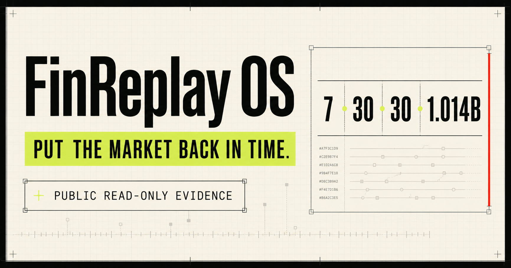
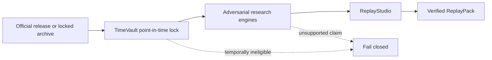

# FinReplay OS

[](https://github.com/limingrui679-design/finreplay-os/actions/workflows/verify.yml)
[](https://github.com/limingrui679-design/finreplay-os/actions/workflows/security.yml)
[](https://www.python.org/)
[](LICENSE)
[](https://finreplay-evidence.limingrui2.chatgpt.site/)

**Put the market back in time. Put the strategy on trial. Decide whether to allocate capital.**

FinReplay OS is an open-source, point-in-time financial-system replay toolkit. It separates what
was known at a decision time from what became known later, subjects research claims to adversarial
checks, and emits a portable ReplayPack whose inputs, reasoning artifacts, and render are bound by
deterministic hashes.



## Three-minute offline demo

The flagship demo runs from seven byte-locked official-source facts bundled in the package. It
makes no network request and creates a verified HTML/JSON/Markdown ReplayPack plus a deterministic
ZIP.

```bash
git clone https://github.com/limingrui679-design/finreplay-os.git
cd finreplay-os
python3.12 -m venv .venv
.venv/bin/pip install -e .
.venv/bin/finreplay demo svb-2023 --offline --open
```

Expected terminal fields include `demo_complete=true`, `offline=true`, `engines=7`, the trace ID,
the pack SHA-256, and the local report path. To recheck the recorded identity without keeping an
output directory:

```bash
.venv/bin/finreplay scenario verify svb-2023
```

The command must reproduce pack hash
`c62c22dcbd15e29592a10811117a565d2bf9bee34877a4fbcbf24994383efd35`.

## What is implemented

| Surface | Current machine evidence |
|---|---|
| Seven connected engines | One deterministic SVB boundary flow executes all seven engines over seven locked facts and passes cross-engine assertions |
| Official-source validation | 30 live-validated formal adapters, each with a temporal-coverage label and receipt |
| Scenario runners | 30/30 internally replay-proven bounded scenarios with installable input locks |
| Scale path | 244 continuous SEC EDGAR daily partitions with 1,014,736,394 exact physical CSV rows in the committed scale manifest |
| Clean quality gate | 2,212/2,212 tests passed with 90.184801% branch-aware combined coverage on commit `e8118983b260` |
| Public demo and external review | Public demo achieved; independent review pending |

The [acceptance matrix](docs/verification/acceptance-matrix.md) defines each completion rule. The
[public claim registry](verification/claims/public-claims.json) binds headline counts to committed
machine evidence and scans public text for a bounded set of inflated claims.

## Explore by capability

FinReplay ships a machine-readable capability map so readers can start with a decision question
instead of treating 30 scenarios as an undifferentiated gallery. Every path is labelled:

| Scope | Meaning | Example paths |
|---|---|---|
| `direct` | Implemented code and committed evidence support the capability | Point-in-time data, statistical falsification, decision and risk, systems delivery |
| `transferable` | The method is demonstrated here; adjacent-domain practice is not | Public-policy evidence boundaries |
| `boundary_only` | The cases show what cannot be inferred | Behavioral mechanisms; population and place claims |

```bash
finreplay capability list
finreplay capability list --scope direct
finreplay capability show decision-risk
finreplay scenario explain svb-2023
finreplay scenario pathways
```

Use the [public capability explorer](https://finreplay-evidence.limingrui2.chatgpt.site/capabilities)
to inspect all ten capability paths,
the generated [capability map](docs/capability-map.md), or the packaged
`capability-catalog.json`. The map is deliberately school-neutral: relevance to health, behavior,
policy, or place does not become a claim of clinical, intervention, public-client, or spatial work.
The separate [scenario explorer](docs/scenario-explorer.md) records a primary method, decision
question, ten overlapping analytical dimensions, five cross-case pathways, and the complete
3-boundary / 8-evaluation-only / 19-breach outcome composition. Those tags organize existing
ReplayPacks; they do not add results or strengthen a capability scope.

## Seven connected engines

1. **TimeVault** stores bitemporal facts and answers “what was knowable then?”
2. **TrialCourt** records preregistration, all trials, leakage checks, and multiplicity attacks.
3. **MarketTwin** models evidence-graded institution, security, issuer, and fund relationships.
4. **ShockCompiler** expresses observed, bounded, counterfactual, and adversarial shocks.
5. **ExecutionLab** models cost, latency, queue, liquidity, capacity, and failure envelopes.
6. **CapitalAllocator** applies robust allocation constraints, reversal thresholds, and value of
   information.
7. **ReplayStudio** compiles and verifies human- and machine-readable ReplayPacks.



## CLI map

```text
finreplay adapter list|show|fetch|validate
finreplay scenario list|show|explain|pathways|run|verify
finreplay capability list|show
finreplay replaypack build|verify|open
finreplay evidence verify [--all-scenarios]
finreplay demo [SCENARIO] --offline [--open]
```

Examples:

```bash
# See the formal live-validation catalog and its temporal boundaries.
finreplay adapter list
finreplay adapter list --historical-only

# Inspect or run any packaged scenario without network access.
finreplay scenario show bls-cpi-2023
finreplay scenario explain bls-cpi-2023
finreplay scenario pathways
finreplay scenario run bls-cpi-2023 ./out/bls-cpi --archive ./out/bls-cpi.zip

# Validate catalogs quickly, or reproduce all 30 scenario hashes.
finreplay evidence verify
finreplay evidence verify --all-scenarios
```

`adapter fetch` currently provides a packaged generic parameter contract for
`fdic.bankfind.financials`; the remaining adapters expose source-specific Python APIs. This limit is
reported explicitly instead of pretending that incompatible upstream query models share one safe
generic parameter set.

## Formal adapters versus scenario connectors

The two surfaces are intentionally separate:

- The **formal live-adapter catalog** records 30 current live validations. Only 3 are presently
  marked historical-replay eligible; a successful current response does not backdate its values.
- The **offline scenario catalog** records 30 bounded research cases and bundles only the exact
  locked inputs used by their counted proofs. Some cases use scenario-specific archive connectors
  that are not silently added to the capped formal-adapter total.

See the [catalog and eligibility matrix](docs/catalog-matrix.md), [adapter authoring guide](docs/adapter-authoring.md),
and [scenario authoring guide](docs/scenario-authoring.md).

## Python API

```python
from pathlib import Path

from finreplay.catalog import (
    find_capability,
    find_scenario,
    load_adapter_catalog,
    run_scenario,
)

entry = find_scenario("svb-2023")
result = run_scenario(
    entry.slug,
    Path("out/svb-2023"),
    archive=Path("out/svb-2023.zip"),
)
assert result.receipt.pack_sha256 == entry.pack_sha256

historical = [
    adapter.adapter_id
    for adapter in load_adapter_catalog().adapters
    if adapter.historical_replay_eligible
]

decision_risk = find_capability("decision-risk")
assert "svb-2023" in decision_risk.scenario_slugs
```

More runnable material is in [`examples/`](examples/) and the
[quickstart](docs/quickstart.md). Evidence labels are defined in
[`docs/evidence-labels.md`](docs/evidence-labels.md). The
[system overview](docs/architecture/system-overview.md) shows how sources, engines, ReplayPacks,
catalogs, the CLI, and the public explorer remain connected without sharing claim authority.

## Development

Python 3.11 and 3.12 are tested.

The complete contributor gate is one command after setup:

```bash
make bootstrap
make verify
```

The expanded commands remain available for CI diagnosis:

```bash
python3.12 -m venv .venv
.venv/bin/pip install -e '.[dev]'
.venv/bin/python scripts/build_user_catalogs.py --check
.venv/bin/python scripts/build_public_replaypack_downloads.py --check
.venv/bin/python scripts/build_public_claim_registry.py --check
.venv/bin/ruff check .
.venv/bin/mypy src tests scripts
.venv/bin/pytest --cov=finreplay --cov-report=term-missing
.venv/bin/python scripts/verify_scenario_catalog.py
.venv/bin/python scripts/validate_independent_review_records.py
.venv/bin/python scripts/scan_tracked_secrets.py
.venv/bin/python -m pip_audit --local
npm run lint --prefix web
npm test --prefix web
npm audit --prefix web
```

The same gates run in GitHub Actions on Python 3.11 and 3.12, with a separate locked Node 22 site
build. The repository also checks distribution installation, dependency changes, dependency
vulnerabilities, CodeQL findings, and committed secrets. See
[`CONTRIBUTING.md`](CONTRIBUTING.md) for the pull-request path and [`ROADMAP.md`](ROADMAP.md) for
bounded next steps.

## Independent review

Independent review is still pending. A qualified reviewer can use the
[review protocol](docs/verification/independent-review-protocol.md) and open a bounded
[independent-review report](https://github.com/limingrui679-design/finreplay-os/issues/new?template=independent-review.yml).
An issue, form submission, passing schema, or maintainer-run reproduction does not by itself close
that gate.

## Truth boundaries

- `observed`, `reported`, `extracted`, `inferred`, and `simulated` remain distinct labels.
- Economic time and knowledge/availability time are separate fields.
- A revised current value cannot silently replace a historical vintage.
- Public-data cases are not clients; historical replays are not live trading.
- Simulated P&L is not investment performance.
- Tests and hashes prove internal behavior, not source authenticity or real-world impact.
- Missing microstructure or exposure data produces bounds, not fabricated precision.
- The public deployment receipt is time-bounded availability evidence, not continuous uptime,
  adoption, or user-impact evidence.

## Research and investment disclaimer

FinReplay OS is research software. It does not provide investment, legal, accounting, or risk
management advice and does not connect to brokerage execution by default.

## License and citation

Code is released under [Apache-2.0](LICENSE). Dataset licenses and redistribution rules are
source-specific; a connector does not grant a right to redistribute upstream data. Cite the
software using [`CITATION.cff`](CITATION.cff).
