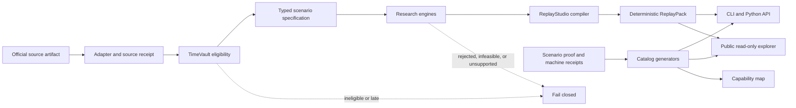

# FinReplay OS system overview

FinReplay OS is a local-first research system for reconstructing what was knowable at a financial
decision boundary, testing a claim under declared attacks and constraints, and exporting one
portable evidence package. The system is intentionally split into source, method, compilation,
verification, and presentation layers so a polished page cannot grant authority to an unsupported
claim.

## End-to-end flow

The arrows show data and artifact flow, not trust inheritance. A passing adapter receipt does not
make a method correct. A deterministic ReplayPack does not authenticate an upstream publisher. A
public page does not create external review, adoption, or impact.

## Layer responsibilities

| Layer | Owns | Must not claim |
|---|---|---|
| Adapters and source receipts | Fetch bounds, source identity, response hashes, normalized records, redistribution class | Historical eligibility merely because a current response contains an old date |
| TimeVault | Economic time, knowledge time, revision lineage, point-in-time queries | Source authenticity or causal meaning |
| TrialCourt | Preregistration, attempts, leakage checks, multiplicity, regime and friction gates | That `eligible` means deployable or profitable |
| MarketTwin | Evidence-graded temporal entity and relationship graphs | Complete exposure networks or causal contagion |
| ShockCompiler | Observed reconstructions, bounded intervals, counterfactuals, adversarial grids | Probabilities or forecasts not supplied by evidence |
| ExecutionLab | Cost, latency, queue, liquidity, and capacity envelopes | Broker fills, realized costs, or executable live capacity |
| CapitalAllocator | Feasibility, robust objectives, downside constraints, reversals, value of information | Fiduciary advice, orders, or investment performance |
| ReplayStudio | Semantic checks, deterministic render, manifests, hashes, portable archive | External method validation or upstream authentication |
| Catalogs and capability map | Discoverability, exact evidence locators, curated routes, scope labels | New scenario results or adjacent-domain experience |
| Public explorer | Read-only navigation, downloads, visible limits | Continuous uptime, users, adoption, or impact |

## Contract and identity boundaries

The Python core uses immutable Pydantic contracts with unknown-field rejection. A scenario binds a
stable scenario ID, version, replay ID, decision time, code revision, source records, evidence
classes, limitations, claims, and engine artifacts. ReplayStudio then produces:

- `report.json`, the complete machine-readable compiled graph;
- `index.html`, the human-readable view of the same graph;
- `manifest.json`, the self-hashed pack receipt and file inventory;
- `checksums.sha256`, portable relative-path checksums;
- `README.md`, the local verification route and truth boundaries; and
- `assets/styles.css`, the standalone report presentation.

The deterministic pack identity excludes runtime duration. Runtime can be recorded by an outer
verification receipt without making repeated builds produce different package bytes.

## Generated discovery surfaces

Repository evidence is converted into three installable discovery catalogs:

1. `adapter-catalog.json` exposes the formal live-validation inventory and temporal eligibility.
2. `scenario-catalog.json` exposes byte-locked offline runners and recorded ReplayPack identities.
3. `capability-catalog.json` maps direct, transferable, and boundary-only capabilities to curated
   scenarios and exact evidence locators.

`scripts/build_user_catalogs.py --check` recomputes these catalogs and their documentation. The
capability source is school-neutral and cannot alter a scenario claim or ReplayPack. Its
`transferable` and `boundary_only` labels are negative controls: they prevent a reusable method
from being presented as domain deployment or impact.

The separate `scenario-explorer.json` is presentation metadata, not a fourth source of results. It
assigns every canonical case a primary method, decision question, overlapping analytical
dimensions, and optional cross-case pathways. `scripts/build_public_replaypack_downloads.py
--check` cross-validates all 30 slugs, rebuilds the public download manifest, and renders the site
catalog plus `docs/scenario-explorer.md`; its `--write` mode also canonicalizes and recomputes the
package explorer's self-hash. Capability scope answers how strongly the repository
supports a skill; explorer dimensions answer what a case touches. Neither layer may override a
ReplayPack claim or evidence class.

## Extension points

### Add an adapter

Implement the source-specific contract, keep raw responses content addressed and outside the
redistributable surface unless permitted, emit a verification receipt, and document the temporal
coverage. A generic CLI fetch command is added only when the upstream parameter model can be
represented without hiding source constraints.

### Add a scenario

Provide one byte-locked input, loader, builder, proof, deterministic ReplayPack, documentation, and
fresh-process rebuild receipt. The counted inventory changes only after all repository acceptance
gates pass.

### Add a capability path

Edit `capabilities/catalog.json`, reference existing scenario slugs and existing evidence files,
select the narrowest truthful scope, regenerate the catalogs, and run the package and site tests.
Capability metadata improves navigation; it must not modify observed results or imply a new domain
case.

## Failure model

FinReplay prefers a visible bounded or failed result over a silent fallback. Representative
failures include:

- an artifact was published after the decision time;
- a current response cannot establish its historical publication vintage;
- an observed, reported, or extracted value lacks a source identity;
- a trial omits an attempt or violates its holdout/embargo;
- a bounded or adversarial shock lacks valid endpoints;
- execution evidence does not overlap the executable interval;
- allocation constraints are infeasible;
- a compiled claim lacks a support locator or changes evidence class;
- a generated catalog references an unknown scenario or missing evidence file; and
- a ReplayPack file, manifest, or archive no longer matches its recorded digest.

These are engineering and research-integrity controls. They do not replace independent source,
security, statistical, financial, policy, health, or spatial review.
