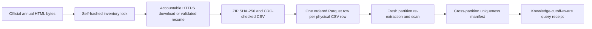

# SEC EDGAR access-log scale proof

This workstream is an exact physical-row scale test over the SEC Division of Economic and Risk
Analysis EDGAR Log File Data Sets. It is not a unique-user data set, a market-event feed, a client
engagement, a production deployment, or evidence of adoption or impact.

## Current machine state

[`verification/scale/sec-edgar/latest-scale-manifest.json`](../../verification/scale/sec-edgar/latest-scale-manifest.json)
is the only current aggregate scale authority. At the two-partition smoke checkpoint it seals
`4,592,824` physical CSV data rows from January 1–2, 2012 and says
`target_met=false` against the declared `1,000,000,000`-row target. The number in this paragraph is
only a human-readable snapshot; later receipts and the self-hashed manifest supersede it.

The source inventory is locked from the official annual SEC pages:

- 2012: 366 explicitly listed daily archives;
- 2013: 365 explicitly listed daily archives.

Those legacy pages list `http://www.sec.gov/...` archive links. Each inventory item preserves that
exact value as `listed_url` and separately records an HTTPS retrieval URL with the identical
`www.sec.gov` host and path. The parser will not normalize another host, infer an unlisted date, or
follow a redirect.

## What one record means

One counted record is one physical CSV data row in one fully hashed official daily ZIP. Its identity
is:

```text
(unique source ZIP SHA-256, one-based CSV data-row ordinal)
```

The scale manifest rejects duplicate partition dates, source URLs, ZIP hashes, coordinate hashes,
and partition-receipt hashes. Repeated requests inside an official log are intentionally retained;
there is no semantic deduplication, extrapolation, sampling weight, or synthetic multiplier.

The identity is not a person. SEC obfuscates IP addresses, and the compact Parquet derivative omits
the IP field entirely for data minimization. The derived row retains event date, seconds within the
logged day, Apache zone code, CIK, accession, document, response status and size, index/referrer/
agent/crawler flags, browser code, source row ordinal, and an anomaly bit mask.

Malformed values do not disappear. Structurally malformed CSV fails closed; field-level source
anomalies remain as output rows, receive null typed values where necessary, set the relevant bit,
and appear in exact invalid-row counts. SEC's own warning that lost or damaged files and extraction
limitations can make the source logs incomplete remains part of every partition and aggregate claim
boundary.

## Evidence chain



The accountable `User-Agent` is supplied through `FINREPLAY_SEC_USER_AGENT`. Receipts persist only
its SHA-256; they do not publish the contact value. A self-hashed partial sidecar binds URL,
validator, total bytes, and User-Agent identity. A resumed response must provide a matching ETag or
Last-Modified validator and an exact `Content-Range`. Finished files replace temporary files
atomically. Extracted CSV is temporary; the official ZIP and compact Parquet remain local and
gitignored, while small source locks and evidence receipts are committed.

The bounded runner permits at most four concurrent long-running transfers and spaces starts by
default. This keeps request starts below the SEC fair-access ceiling; changing the worker cap
requires a code change rather than an unconstrained CLI value.

## Rebuild and verify

Set an accountable contact-bearing User-Agent locally, then resume ingestion:

```bash
export FINREPLAY_SEC_USER_AGENT='FinReplayOS/0.1 research contact you@example.com'
.venv/bin/python scripts/build_sec_edgar_log_lake.py \
  --inventory-lock verification/scale/sec-edgar/inventory/edgar2012.inventory-lock.json \
  --inventory-lock verification/scale/sec-edgar/inventory/edgar2013.inventory-lock.json \
  --target-rows 1000000000 \
  --workers 4 \
  --fast-existing
```

`--fast-existing` skips repeated deep scans only for already sealed partitions; each new partition
is still downloaded or validator-resumed, materialized, and deeply verified before its receipt is
written. The final scale claim requires a fresh deep pass without that shortcut:

```bash
.venv/bin/python scripts/verify_sec_edgar_scale.py \
  --inventory-lock verification/scale/sec-edgar/inventory/edgar2012.inventory-lock.json \
  --inventory-lock verification/scale/sec-edgar/inventory/edgar2013.inventory-lock.json \
  --deep
```

## Point-in-time boundary

SEC access-log event time and this project's archive-observation time are different facts. An as-of
query accepts both an event cutoff and a timezone-aware knowledge cutoff. A partition is ineligible
until its recorded `archive_retrieved_at`, so a log archive first verified here in 2026 is never
represented as information known to this project in 2012. The receipt also counts rows with invalid
event time separately and excludes them from cutoff aggregates without deleting them from the
input-row total.

Query receipts record exact input hashes, scanned rows and bytes, DuckDB version, elapsed time, and
whether the process was fresh or reused. They always label OS cache as uncontrolled. A local timing
is therefore a measured machine observation, not a universal throughput or production-SLA claim.

## Remaining gates

The billion-row gate remains open until the manifest itself reports at least one billion exact rows
and a fresh deep verifier passes. After that, a final billion-row query/benchmark receipt is still a
separate requirement. Neither gate substitutes for the public demo, independent reproduction or
domain review, governance certification, real users, or demonstrated real-world impact.
